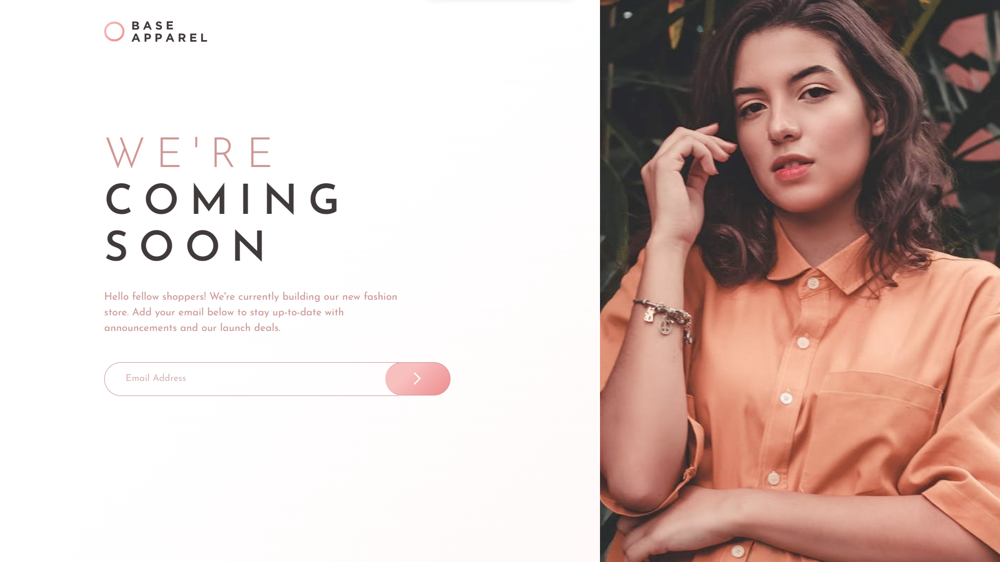

# Frontend Mentor - Base Apparel coming soon page solution

This is a solution to the [Base Apparel coming soon page challenge on Frontend Mentor](https://www.frontendmentor.io/challenges/base-apparel-coming-soon-page-5d46b47f8db8a7063f9331a0). Frontend Mentor challenges help you improve your coding skills by building realistic projects. 

## Table of contents

- [Frontend Mentor - Base Apparel coming soon page solution](#frontend-mentor---base-apparel-coming-soon-page-solution)
  - [Table of contents](#table-of-contents)
  - [Overview](#overview)
    - [The challenge](#the-challenge)
    - [Screenshot](#screenshot)
    - [Links](#links)
  - [My process](#my-process)
    - [What I learned](#what-i-learned)
    - [Continued development](#continued-development)
    - [Useful resources](#useful-resources)
  - [Author](#author)

## Overview

### The challenge

Users should be able to:

- View the optimal layout for the site depending on their device's screen size
- See hover states for all interactive elements on the page
- Receive an error message when the `form` is submitted if:
  - The `input` field is empty
  - The email address is not formatted correctly

### Screenshot




### Links

- Solution URL: [Frontend Mentor](https://www.frontendmentor.io/challenges/base-apparel-coming-soon-page-5d46b47f8db8a7063f9331a0/hub)
- Live Site URL: [Vercel](https://base-apparel-coming-soon-xi-three.vercel.app)

## My process

### What I learned

I learned how to validate a simple email form using a Regex and if it returns false, I also learned how to show the error messages. See below:

```html
<form class="email-container">
    <input type="email" placeholder="Email Address" class="email-input" novalidate>
    
    <button onclick="validateEmail()" type="button" class="email-button"></button>
</form>
<p class="error-message">Please provide a valid email</p>
```
```css
/* Email Button */
.email-container {
    display:flex;
    position: relative;
    justify-content: flex-start;
    align-items: center;
    margin-top: 2.5rem;
}
.email-input{
    font-family: "Josefin Sans", sans-serif;
    width: 420px;
    border: 1px solid hsl(0, 36%, 70%);
    border-radius: 50px;
    height: 50px;
    background-color: transparent;
    padding-left: 32px;
    border-right: none;
    border-top-right-radius: 0px;
    border-bottom-right-radius: 0px;
}
.email-input::placeholder {
    font-size: 0.9rem;
    color: hsla(0, 36%, 70%, 0.7);
}
.email-input:focus {
    outline: none;
}
.email-button {
    position: absolute;
    background: linear-gradient(135deg, rgba(248,191,191,1) 35%, rgba(238,140,140,1) 100%);
    width: 100px;
    height: 51px;
    border-radius: 50px;
    font-size: 1.8rem;
    font-weight: 400; 
    right: 70px;
    color: white;
    border: 1px solid hsl(0, 36%, 70%);
    border-left: none;
}
.email-button:hover {
    opacity: 0.7;
}
.email-button:active {
    opacity: 1;
}
/* ! Error Message */
.error-message {
    color: hsl(0, 93%, 68%);
    font-size: 14px;
    margin: 10px 0px 0px 32px;
    visibility: hidden;
}
.error-image {
    position: absolute;
    right: 190px;
    visibility: hidden;
}
```
```js
let errorMessage = document.querySelector(".error-message");
let errorImage = document.querySelector(".error-image");
let emailButton = document.querySelector(".email-button");
let emailInput = document.querySelector(".email-input");

function validateEmail () {
    var regex = /\S+@\S+\.\S+/;
    let result = regex.test(emailInput.value);
    if (result === false) {
        errorMessage.style.visibility = "visible";
        errorImage.style.visibility = "visible";
    } else {
        errorMessage.style.visibility = "hidden";
        errorImage.style.visibility = "hidden";
    }
    console.log(result);
}

```
### Continued development

I struggled alot on the email button and the erorr messages. I will continue to take feedback from the community and implement it into the email button and error messages and turn it into a more responsive form and user experience.

### Useful resources
- [CSS Gradient ](https://cssgradient.io) - This helped me visualize and generate linear color code for my CSS.
- [How To Validate An Email Address in JavaScript](https://stackoverflow.com/questions/46155/how-can-i-validate-an-email-address-in-javascript) - Only reason I was able to validate my Email Form.
- [How To Remove The Border Highlight on an Input Text Element](https://stackoverflow.com/questions/1457849/how-to-remove-the-border-highlight-on-an-input-text-element) - I had a bug where whenever you clicked the email input, it would show a border outline of black and it looked ugly. This thread taught me how to remove that.

## Author

- Website - [Justin Vera](https://www.justinvera.com)
- Frontend Mentor - [@justinnvera](https://www.frontendmentor.io/profile/justinnvera)
